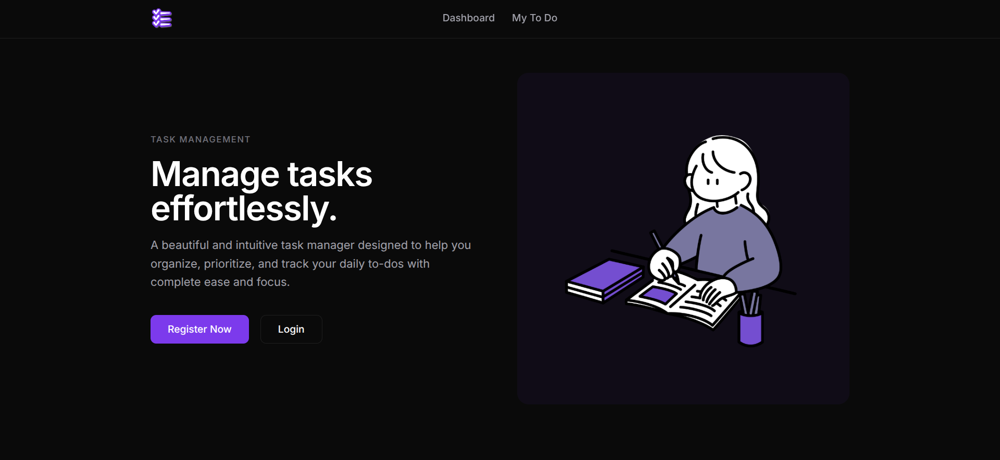
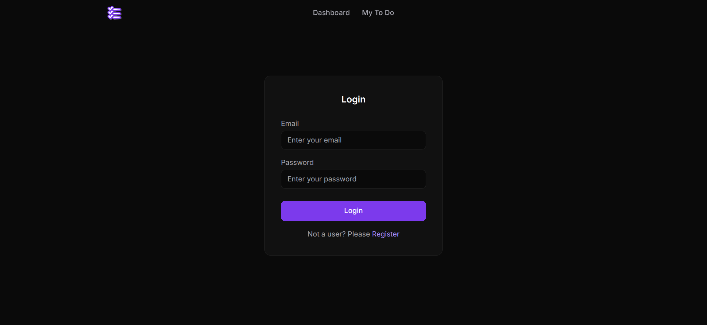
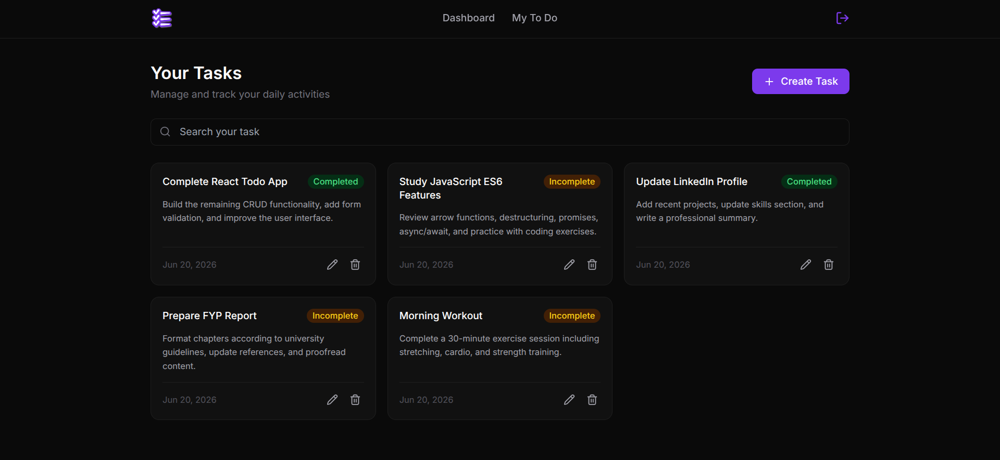

## 🏢 mern-todo-app - Full-Stack Task Manager

A professional **full-stack Todo application** built with modern MERN stack technologies. This project focuses on a clean design, responsive layout, and user-friendly experience across all devices to manage daily tasks seamlessly.  

## 🛠️ Technologies Used
- MongoDB & Mongoose
- Express.js  
- React.js & Vite  
- Node.js  
- TailwindCSS  
- React Router DOM  
- JSON Web Tokens (JWT) & bcryptjs  

## ✨ Features
- ✅ Responsive design (mobile, tablet, desktop)  
- ✅ Modern and elegant UI design  
- ✅ Secure user authentication (Signup, Login, Protected Routes)  
- ✅ Dashboard showing tasks overview (Total, Pending, and Completed tasks)  
- ✅ Manage, filter, and track todos easily  

## 🚀 How to Run Locally

### 1. Clone the Repository
```bash
git clone <repository-url>
cd mern-todo-app
```

### 2. Set Up Environment Variables
Create a `.env` file in the root directory and configure it as shown in `.env.example`:
```env
PORT=8080
MONGO_URL_CLOUD=your_mongodb_connection_string
JWT_SECRET=your_jwt_secret_key
CLIENT_ORIGIN=http://localhost:5173
```

### 3. Install Dependencies
Install dependencies for both backend and frontend:
```bash
npm install
cd client
npm install
cd ..
```

### 4. Run the Application
Start the backend server and frontend client concurrently:
```bash
npm run dev
```
Open your browser and navigate to `http://localhost:5173`.

## 👀 Preview
### Home Page


### Login Page


### Dashboard Page

